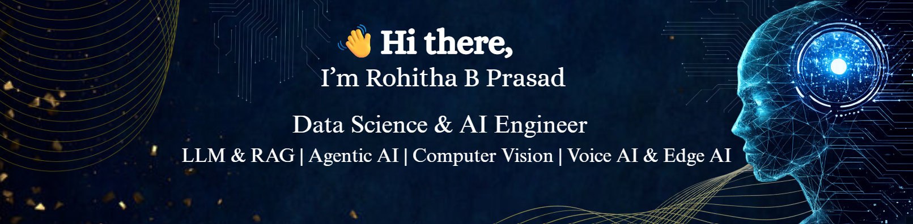
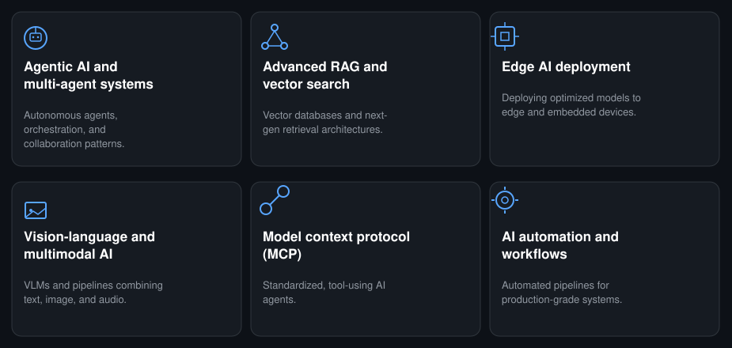
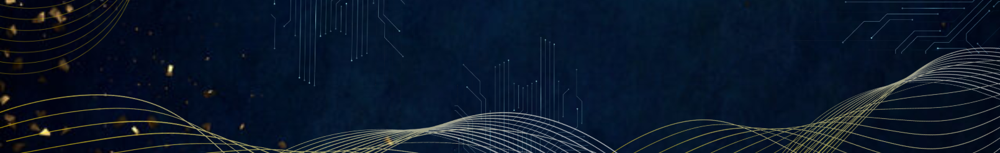

<!--Banner-->

<!--Header Name-->

A passionate <B>AI Engineer</B> dedicated to building intelligent, scalable, and production-ready AI systems.My expertise spans <B>Generative AI, Agentic AI, Large Language Models (LLMs), Machine Learning, Data Science, Data Analytics, Computer Vision, and Full-Stack AI Development</B>, with a strong focus on transforming cutting-edge AI research into impactful real-world solutions.

Currently, I work as a<B>Data Science & AI Engineer</B> at <B>Evolve Robotics LLP</B>, where I design, develop, and deploy end-to-end AI solutions using modern AI frameworks, LLMs, AI agents, data analytics, and cloud-native technologies. I enjoy bridging research, engineering, and deployment to build scalable, reliable, and production-ready AI applications.

<h2 align="center">Tᴇᴄʜ Sᴛᴀᴄᴋ & Exᴘᴇʀᴛɪsᴇ</h2>

<!--I specialize in building end-to-end AI solutions by combining **Artificial Intelligence, Machine Learning, Deep Learning, Data Analytics, Generative AI, Agentic AI**, and modern software engineering. My expertise spans the full AI lifecycle — from data preprocessing and feature engineering to model development, deployment, monitoring, and production optimization.-->

<!--I build intelligent applications using **Large Language Models (LLMs), RAG, Multi-Agent Systems, Vector Databases, Semantic Search, Computer Vision, NLP, Voice AI, and Edge AI**, focused on shipping scalable, explainable, and production-ready systems.-->

<!--Header Name-->

<!-- AI Core -->

<h2 align="center">Cᴜʀʀᴇɴᴛʟʏ Exᴘʟᴏʀɪɴɢ</h2>

<!-- ================================================= -->
<!--               GitHub Stats & Project              -->
<!-- ================================================= -->

<h2 align="center">Gɪᴛʜᴜʙ Sᴛᴀᴛs & Fᴇᴀᴛᴜʀᴇᴅ Pʀᴏᴊᴇᴄᴛ</h2>

<i>Consistency, innovation, and production-ready AI engineering.</i>

<table border="0" cellspacing="0" cellpadding="15" width="100%">
<tr>

<td width="50%" valign="top" align="center">

### 🔥 GitHub Streak

</td>

<td width="50%" valign="top" align="center">

### NEXUSRAG

**Production-ready Retrieval-Augmented Generation Platform**

*14 RAG Architectures • One Unified Engine*

</td>

</tr>
</table>

  

